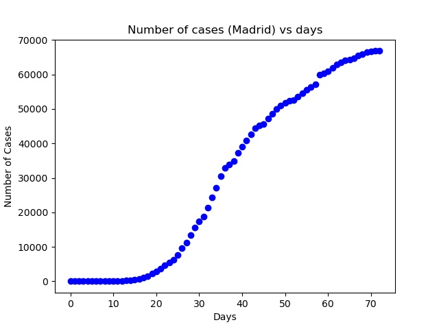
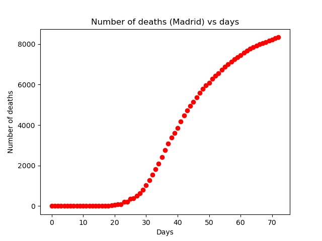
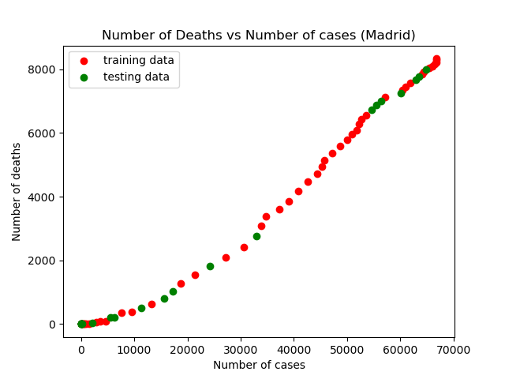
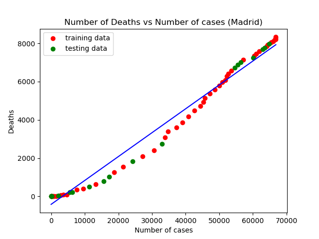

# Covid-19 Madrid: Regression Analysis
## Regression Analysis

Regression is an estimation model used when we want to predict the value of a dependent variable using independent variables.

We have then:

Y(X) where:

Y = Dependent value (what we are looking for)

X = Independent value

Basically, Y is a function of X, so we need to find the function to estimate propperly the parameter that we are looking for. In the context of the global pandemic: Covid-19, regression analysis can be helpful to determinate interesting parameters to fight against this dangerous virus. 

Madrid, as one of the most affected cities in the world by the Covid-19, have significant datasets to know more about the propagation of the virus and the consequences: as deaths, recovered patients, patients in ICU, and others. Find relations in between these variables, could help us to know which kind of actions could we apply to have a smaller mortality rate.

To analyze the data, I started with a Simple-Linear Regression analysis, providing the following results about the relation in between number of cases and number of deaths since Madrid have data to analyze:

The data was found [here](https://data.world/liz-friedman/covid-19-in-spain), and give data about all the autonomous communities of Spain, but you can select any other autonomous community of Spain to your analysis using the same code.

The data start since 2020-02-21 until 2020-05-03.

## Simple-Linear Regression

Simple linear regression is used to estimate a dependent variable based on an independent variable. In this case the Number of deaths as function of the Number of cases.

To know if a Simple linear regression can be used, we can use scatter plots to know as a graphic, the relation between variables.

The Simple-linear regression can be expressed as this equation:

y = m0 + m1*x1 

In this equation, y correspond to the dependent variable that we are looking for, and x1 the independent variable. Our goal is to find the parameters m0 and m1 appropiated to find the line that fit better with the growth of the scatter plot.

So, we can do a scatter plot in python using the matplotlib.pyplot, with the values of Number of deaths vs Days, and the Number of Cases vs Days obtaining the following result:

How we can see, the behaviour of the both functions is today 2020-05-06 similar to a logarithmic behaviour, and stopped to be an exponential behaviour as the first 40-50 days.

So, to start the development of our model, we should start to select only the cases in Madrid, that is easy to do using the library Pandas.

This dataset (in this case I have two datasets) must to be divided in two datasets: the training dataset and the testing dataset, in this case I did a 80-20 division.

Then, we can know if we can really use the simple-linear regression, plotting the relation in between Number of cases and Number of deaths:

How You can see, the behaviour is more or less linear, so Simple-Linear regression is not a bad option. Also we can calculate the correlation in between this variables, to detect if the model have a linear behaviour
In the scatter plot, You can also see, the points used to the training (red) and the points using for testing (green). 

Finally we can find the model, using the scikit-learn from python, is easy to load and build a model importing the linear_model from sklearn. Loading the data from the training set and applying the model we can obtain the parameters, that could provide to us an equation as following:

y = -373.4907455 + 0.12483009*x

As the equation that we are looking for. Plotting this line in the last plot the results are the following

Now we can estimate the accuracy of our regression, for this, we can implement R^2, Residual sum of squares (MSE), and Mean Absolute Error (MAE), also very easy to implement using scikit-learn.

Loading the testing data to check the accuracy, we find results as this:

R^2 = 0.98, where 1 is the best

MAE = 337.63

MSE = 166028.72

You can find the entire python code for this analysis [here](https://github.com/Franzmgarcia03/Coronavirus_Madrid_Regression_Analysis/blob/master/Simple_Regression_CoronavirusMadrid_Deaths.py)

